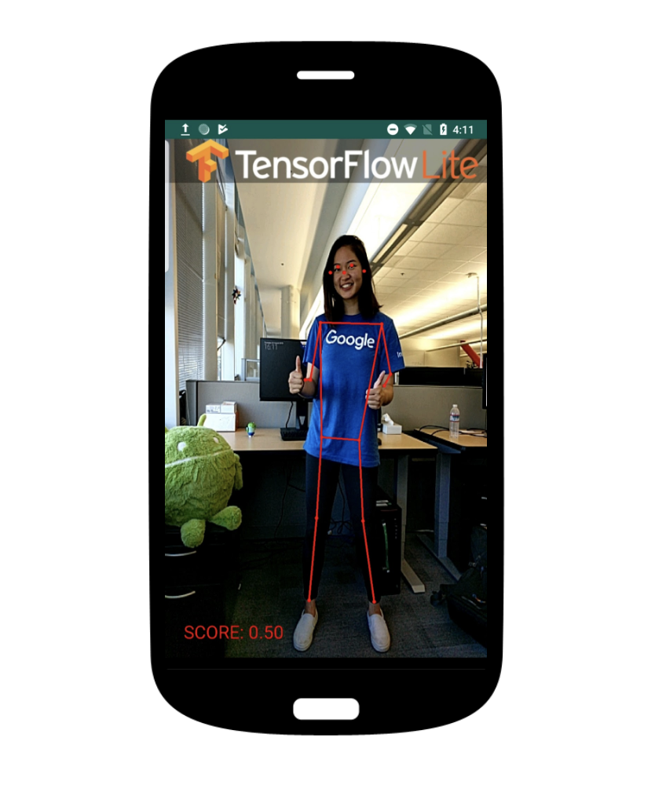

# 안드로이드 pose detection project
### Overview
1) (https://github.com/tensorflow/examples/tree/master/lite/examples/posenet/android) 를 참고한 프로젝트
2) andriod를 통해 pose를 detection후 이를 별도 서버로 전송할 수 있도록 버튼 및 ftp모듈 추가

3) 실시간으로 전송되는 pose 좌표를 다양하게 활용가능 할 것으로 기대

### Additional Note
 
 

-> CameraActivity의 FTP전송 코드에서 ip주소, 포트번호, 계정 정보 입력하면 해당 서버로 안드로이드에서 촬영한 포즈 좌표가 json 형태로 넘어간다.
 

